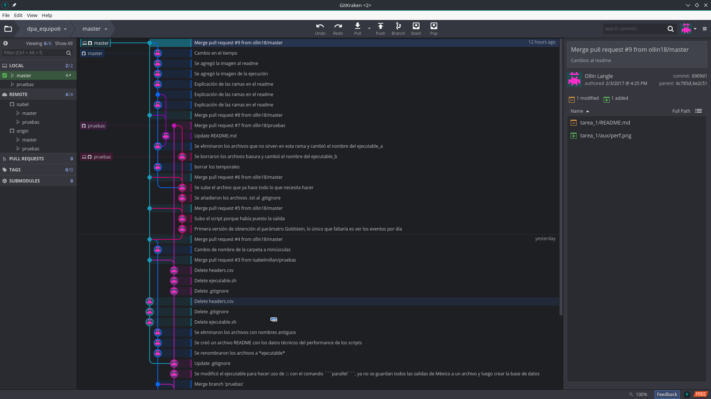

```{r setup, include=FALSE}
knitr::opts_chunk$set(echo = TRUE)
```

Las ramas en GIT sirven para el desarrollo en paralelo de un proyecto que se esté versionando con dicho programa. Es decir, supongamos que se está trabajando en un script y éste ya realiza las tareas para lo que fue escrito pero se quieren añadir nuevas funcionalidades al mismo, entonces, en lugar de escribir sobre algo que ya funciona creamos una separación en nuestra línea de tiempo para poder seguir desarrollando sin perder la versión original.

<p align="center">
  
</p>

Como bien nos explica el Doc Emmet Brown, una rama es una división en el tiempo donde ocurren diferentes cosas que en la línea original. La única diferencia es que en este caso sí podemos juntar ambas líneas mezclando lo que sucedió en ambas líneas.

Para iniciar una rama tenemos dos opciones:
```{bash}
git branch nombre_rama # Esto crea la nueva rama
git checkout nombre_rama # Esto nos cambia a la nueva rama para trabajar en ella
```
O podemos hacer uso de la bandera *-b* del comando ```git checkout``` que engloba ambos comandos, esto es, primero crea la rama y luego se cambia.
```{bash}
git checkout -b rama_nueva
```

Y entonces en conveniente saber qué ramas existen en nuesta carpeta versionada. Esto lo podemos hacer con la bandera *-v*
```{bash}
git branch -v
```

Y si queremos saber cómo se está trabajando en cada una de ellas, lo podemos hacer viendo el historial con ```git log```
```{bash}
git log --graph --decorate --all
```

Cuando un trabajo en una rama se terminó con éxito entonces se puede juntar con la rama *master* para que se añada la nueva funcionalidad. Esto se realiza con el comando ```git merge```
```{bash}
git checkout master
git merge rama_nueva
```

Y finalmente cuando dicha rama dejó de ser útil, ya sea porque no sirvió lo que se estaba realizando o porque ya terminamos de realizar la mejora entonces para tener un área limpia de trabajo podemos eliminarla con la bandera *-d* del comando ```git branch```

```{bash}
git branch -d rama_nueva nombre_rama
```


Un ejemplo visual de lo que ocurre en un repositorio que utiliza ramas comunmente, es el siguiente

<p align="center">
  
</p>

